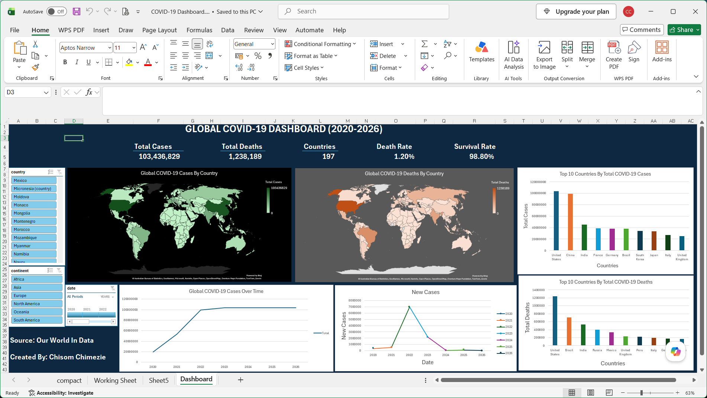

# Global COVID-19 Dashboard (Excel)

## Overview
This project presents an interactive Microsoft Excel dashboard built using the Our World in Data COVID-19 dataset. It enables users to explore COVID-19 cases, deaths, trends, and country-level performance through dynamic visualizations and slicers.

## Features
- Interactive KPI Cards
- Total Cases
- Total Deaths
- Number of Countries
- Death Rate (%)
- Survival Rate (%)
- Filled Map of Total Cases
- Filled Map of Total Deaths
- Top 10 Countries by Cases
- Top 10 Countries by Deaths
- Daily New Cases Trend
- Timeline and Slicers

## Tools Used
- Microsoft Excel
- PivotTables
- PivotCharts
- Filled Map Charts
- Slicers & Timeline
- Data Cleaning

## Dataset
Our World in Data – COVID-19 Dataset

## Dashboard Preview

## Key Insights
- Compare COVID-19 cases and deaths across countries.
- Analyze the countries most affected by COVID-19.
- Track trends in new cases over time.
- Filter results by country, continent, and year.

## Author

**Chisom Chimezie**

GitHub: @Somceedigital
